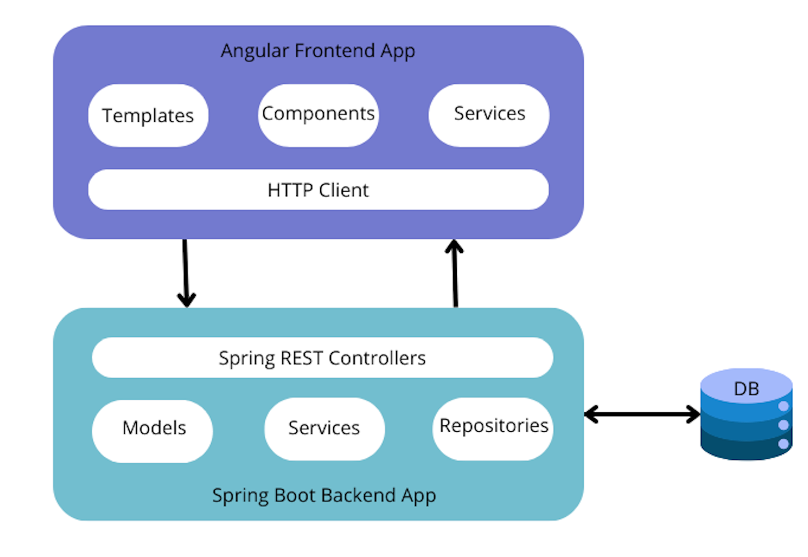
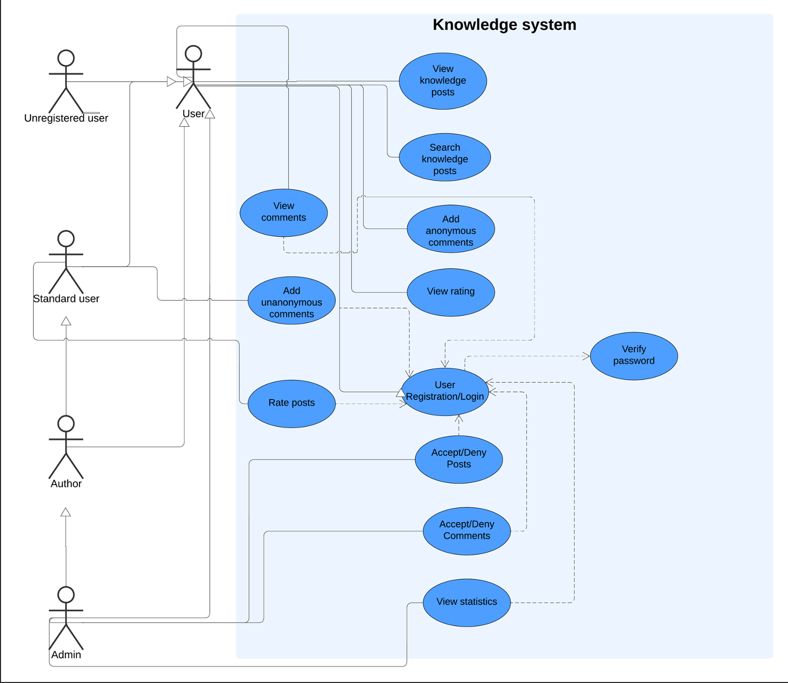
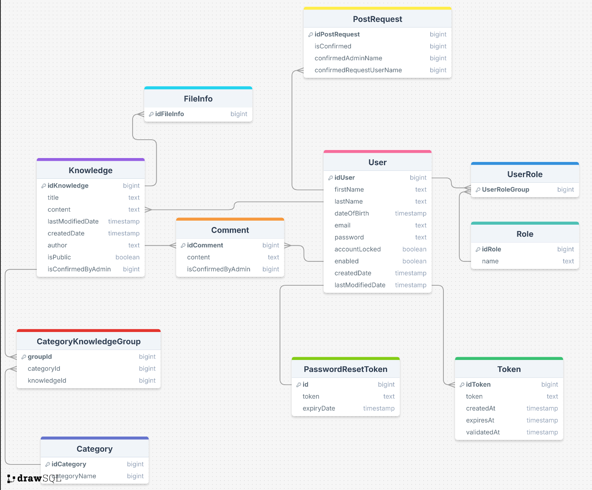
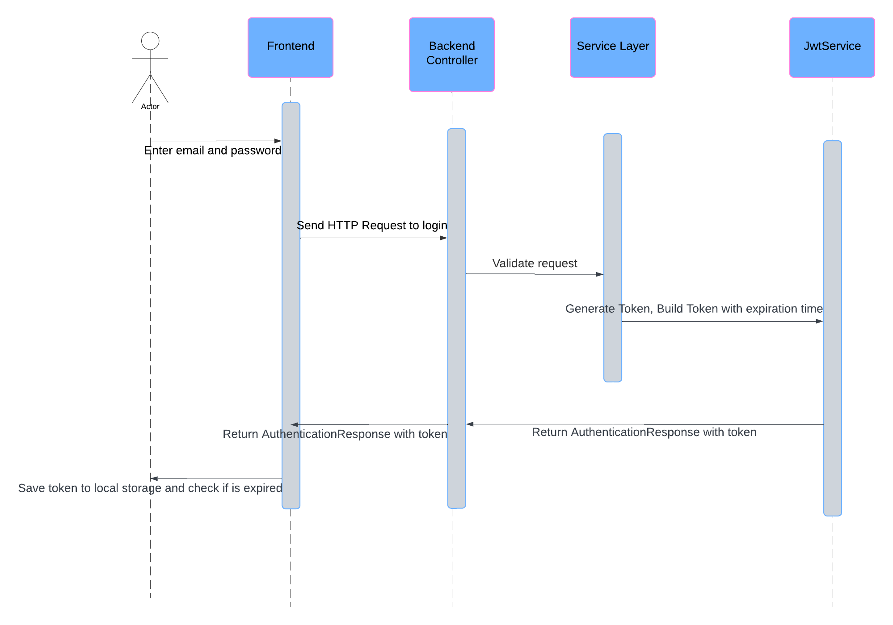

## Table of contents

* General info
* System architecture
* Database schema
* Sequence Diagrams
* Technologies
* Sources

## General info

Component requirements (functional and non-functional).

a.	Functional requirements

-	The system must allow users to log in with an email and password as an admin or user.
-	User can logout.
-	The system must allow to register as an admin or user with an email, password, name, surname.
-	There must be confirmation of  registration sent to an email.
-	There must be password reset functionality.

-	User can add his/her own knowledge through forms.
-	User can edit and delete his/her knowledge.
-	User can view all his/her knowledge in form of a list.
-	User can view detailed page of a knowledge.
-	User can see the messages about public posts confirmation or deny.

-	User or admin can search knowledge.
-	User or admin can search categories.
-	User or admin can search posts written only by specific user.

-	Admin can view admin dashboard.
-	Admin can manage user accounts through the admin dashboard.
-	Admin can manage public posts, accept the addition or deny it. If it is denied he/she must give the reason by providing the message.
-	Admin can view who is the most active user, who has added the most number of posts.

b.	Non-functional requirements
-	The application interface should be user-friendly and intuitive.
-	Passwords must be encrypted in the database.

## System Architecture

## Use case diagrams

## Database schema

## Sequence Diagrams
 
* ### Registration & activation account  

* ### Login  

* ### Password reset  

## Technologies

* Java
* Spring Boot
* Angular
* Postgresql

## Sources
* JWT user login and registration: https://www.youtube.com/watch?v=xqhdRrFzLFY,
https://github.com/ali-bouali/book-social-network
* password reset: https://www.baeldung.com/spring-security-registration-i-forgot-my-password