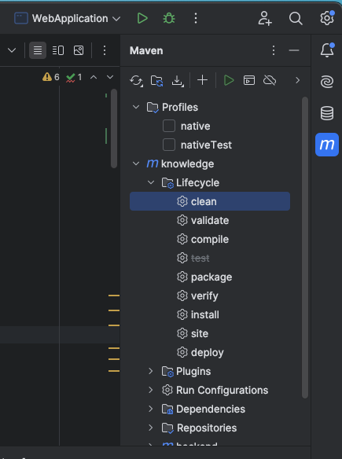
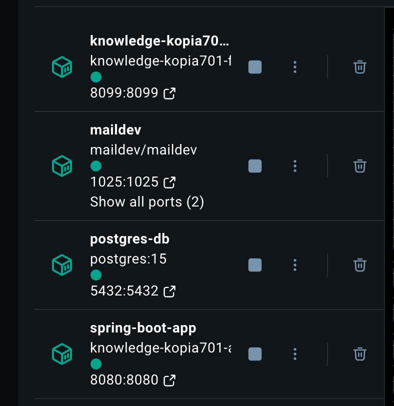

## Table of contents

* How to run the app with docker
* Result
* General info
* System architecture
* Use case diagrams
* Database schema
* Sequence diagrams
* Technologies
* Sources

## How to run the app with docker

* Install IntelliJ, Maven and docker
* Run Clean & Package    
    
* In the command line - this should build backend, frontend, db and maildev server:  
docker-compose up --build  
* To visit application, go to http://localhost:8099  
* To visit maildev, go to http://localhost:1080, here you will have confirmation code for registration  
* Default credentials for admin are:  
email: admin@mail.com  
password: Admin12#%  
* If default credentials doesn't work (data.sql script doesn't execute), create user by the forms, then:
- Open your postgres-db terminal in docker.desktop  
  
- connect to the database  
psql -U katarzyna -d mydb  
- Add the three required roles manually  

INSERT INTO role (created_date, last_modified_date, name) VALUES
('2024-12-22 20:27:36.154666', '2024-12-22 20:27:36.154666', 'USER');

INSERT INTO role (created_date, last_modified_date, name) VALUES
('2024-12-22 20:27:36.154666', '2024-12-22 20:27:36.154666', 'ADMIN');

 
INSERT INTO role (created_date, last_modified_date, name) VALUES
('2024-12-22 20:27:36.154666', '2024-12-22 20:27:36.154666', 'AUTHOR');

- Read your user id (your_user_id)

SELECT * FROM _users;

- Add the admin role for the user manually (enter value of your_user_id instead of placeholder) 

INSERT INTO _user_roles (roles_id_role, users_id_user) VALUES (1, your_user_id);

INSERT INTO _user_roles (roles_id_role, users_id_user) VALUES (2, your_user_id);

INSERT INTO _user_roles (roles_id_role, users_id_user) VALUES (3, your_user_id);

## Result

[

## General info

Component requirements (functional and non-functional).

a.	Functional requirements

-	The system must allow users to log in with an email and password as an admin / author / user.
-	User can logout.
-	The system must allow to register as a user with an email, password, name, surname.
-	There must be confirmation of  registration sent to an email.
-	There must be password reset functionality.

-	User can add, edit and delete his/her own knowledge through forms.
-	User can view all his/her knowledge in form of a list.
-	User can view detailed page of a knowledge and comments under it.
-	It is possible to add comments as an anonymous or registered user.

-	User or admin can search knowledge, categories and authors.

-	Admin can view admin dashboard.
-	Admin can manage user accounts through the admin dashboard.
-	Admin can view who is the most active user, who has added the most number of posts.

b.	Non-functional requirements
-	The application interface should be user-friendly and intuitive.
-	Passwords must be encrypted in the database.

## System Architecture

## Use case diagrams

## Database schema

## Sequence diagrams
 
* ### Registration & activation account  

* ### Login  

* ### Password reset  

## Technologies

* Java
* Spring Boot
* Angular
* Postgresql

## Sources
* JWT user login and registration: https://www.youtube.com/watch?v=xqhdRrFzLFY,
https://github.com/ali-bouali/book-social-network
* password reset: https://www.baeldung.com/spring-security-registration-i-forgot-my-password
